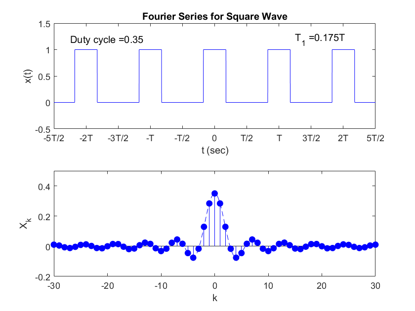
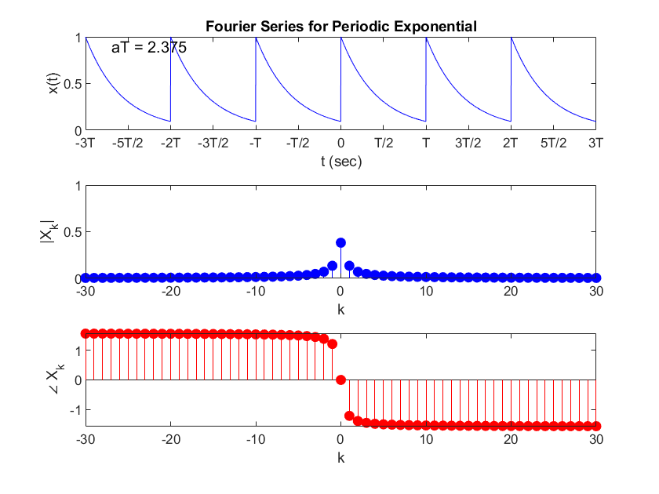
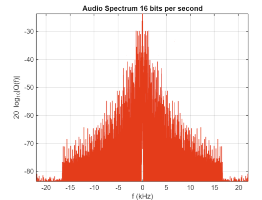

# Signal Processing Code Library
***
## Fourier Series
### Unipolar square wave
filename: Unipolar_square_wave.mlx  
Output: 

### Periodic Exponential 
filename: periodic_exponential.mlx  
Output: 

### Audio Quantization 
filename: audio_quantization.mlx  
Output: 
